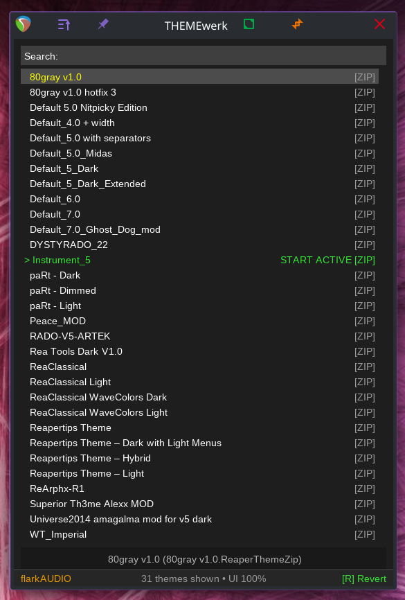

# THEMEwerk

THEMEwerk is a live local theme browser for REAPER. Click a theme, see it instantly, and browse your ColorThemes folder without friction, instead of digging through menus and submenus...

<p align="center">
  <br>
  <em>Current alpha UI with live-apply theme list.</em>
</p>

## Features

- **Live-Apply**: Themes are applied immediately as you click or navigate via keyboard.
- **Directory Sync**: Automatically detects new or removed themes while open.
- **Status Tracking**:
  - **START**: The theme active when you launched THEMEwerk.
  - **ACTIVE**: The theme currently active in REAPER.
  - **NEW**: Themes added during the session.
  - **MISSING**: Previously known themes no longer found on disk.
- **UI Scaling**: Fully continuous scaling system for any display size.
- **Zero Dependencies**: Pure Lua, uses only native REAPER APIs.

## Installation

### Option 1 — Manual
1. Download the latest release.
2. Copy `THEMEwerk.lua` and the `lib/` folder into your REAPER `Scripts` directory.
3. Add `THEMEwerk.lua` via the REAPER Action List.

### Option 2 — ReaPack
Import this repository URL into ReaPack:

```
https://raw.githubusercontent.com/flarkflarkflark/THEMEwerk-reaper/master/index.xml
```

## Controls

- **Click / Arrows**: Apply selected theme immediately.
- **Page Up / Down**: Jump through the list.
- **Home / End**: Go to the first or last theme.
- **R**: Revert to the session-start theme.
- **Mouse wheel**: Scroll list.
- **+ / - / 0**: UI Scale up / down / reset.

## License

MIT License. See [LICENSE](LICENSE) for details.

---
By **flarkAUDIO**
